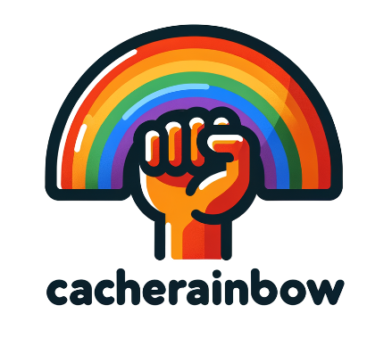

> # Cache anything anywhere anyway.
# Why CacheRainbow?
CacheRainBow is **A High-Performance, Hybrid Cache Solution for Rust**.

When building a service, you'll likely find yourself in need of a caching component to store remote resources locally, reducing the load on remote systems. However, **most Rust caching libraries are memory-based.** While they work well for small workloads, they struggle when you need larger caches, such as 16GB, to meet basic expectations. 16GB of **memory is expensive**.

Introducing CacheRainBow: a hybrid storage solution that combines the speed of memory with the affordability of SSDs. With CacheRainBow, you can use a combination of memory and SSD storage to create a high-performance, cost-effective caching solution for your Rust projects.

🌈 Embrace the rainbow of possibilities with CacheRainBow! 🌈